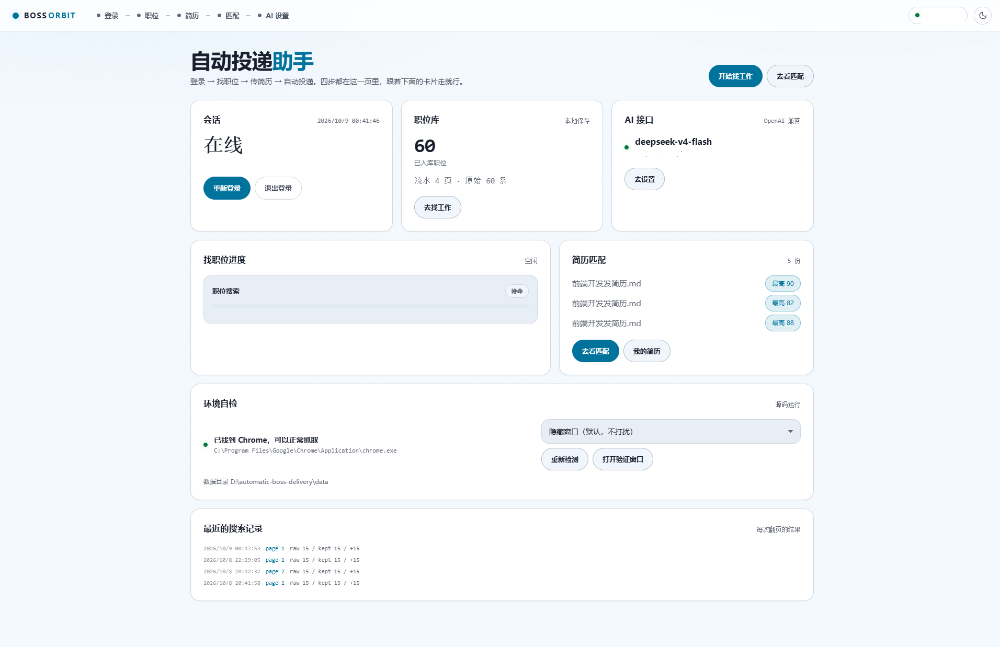
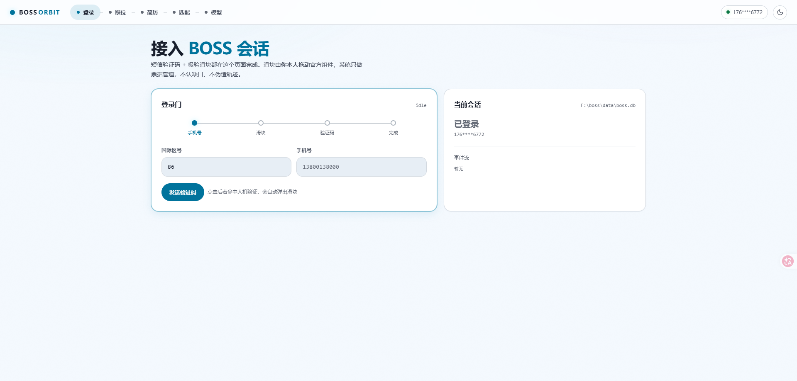
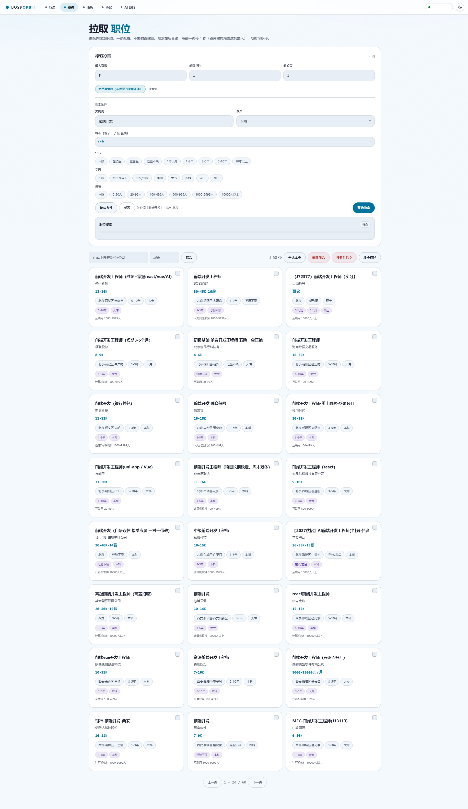
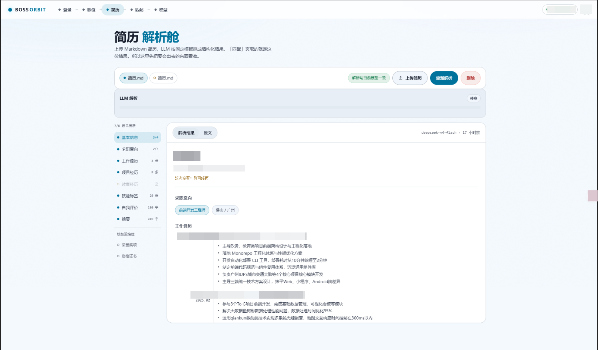
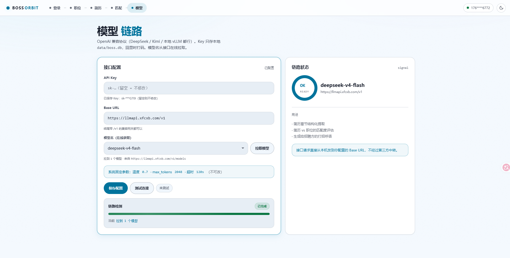
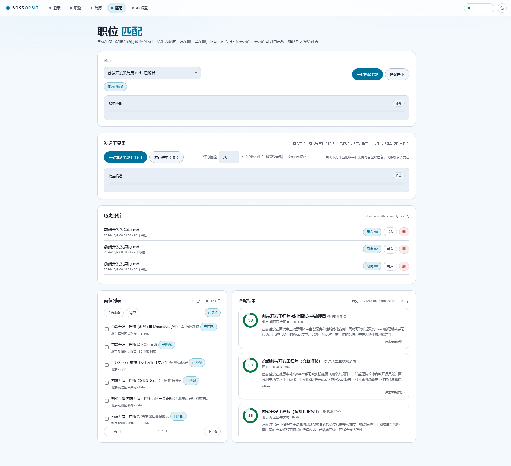
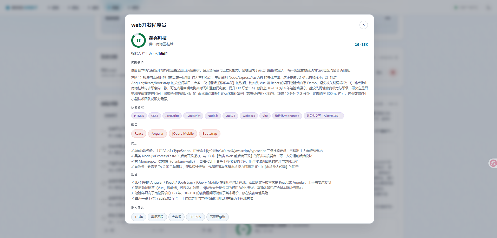
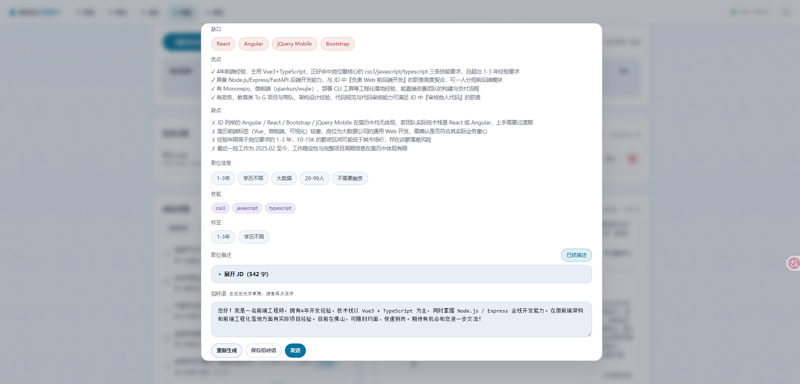

# automatic-boss-delivery

**BOSS 直聘自动投递助手** —— 登录、找工作、简历匹配、写招呼语、一键投递，一条龙跑通。

上传简历（Word / PDF / 纯文本都行）→ 按筛选条件搜索职位 → 调用你自己配置的 AI 生成个性化招呼语 → 确认后一键投递。全部协议走真实接口，不做前端界面模拟。

```
登录 ──► 找职位 ──► 简历匹配 ──► AI 写招呼语 ──► 一键投递
```

> **不想碰命令行？** 直接下打包好的 `BossAutoDelivery.exe`，双击就能用，见 [打包成 exe 分发](#打包成-exe-分发)。

---

## 功能

| 环节 | 说明 |
|------|------|
| **登录** | 手机验证码登录（发码 → 人工填码 → 换 token）。滑块验证是**人机协作**：脚本把挑战图交给你，你在浏览器里拼好再回传，不绕过风控 |
| **筛选条件** | 城市 / 求职类型 / 薪资 / 经验 / 学历 / 行业 / 规模，7 个维度优先打真实 wapi，接口挂了自动退回内置兜底表 |
| **找工作（职位抓取）** | 分页抓取 + 即时清洗 + 入库，页间硬睡节流。`__zp_stoken__` 安全令牌由真 Chrome（CDP）自动计算，不需要手抄 Cookie |
| **简历解析** | 上传简历（`.docx` / `.pdf` / `.md` / `.txt`），提取基本信息 / 求职意向 / 工作经历 / 项目经历 / 教育经历 / 技能 / 自我评价 |
| **智能匹配** | 对选中职位并行调用 AI，生成个性化投递招呼语；结果可重新匹配、单条重生成 |
| **一键投递** | 建会话后走 MQTT over WebSocket + protobuf 帧，把招呼语正文真正发出去 |
| **Web 控制台** | FastAPI + 原生前端，登录 / 职位 / 简历 / 匹配 / AI 设置五页工作台，双光照主题 |

---

## 界面预览

### 概览页

所有功能的入口，也是程序启动后的首屏。



### 登录 BOSS 直聘

短信验证码 + 极验滑块四步走。滑块由你本人拖动官方组件。



### 找工作

按条件分页抓取、卡片化浏览、选中即抓 JD。翻页硬间隔 1 秒防风控，随时可停。



### 上传简历

上传简历（Word / PDF / 纯文本），AI 按固定模板整理成结构化结果——这就是「看匹配」页要吃的那份数据。



### AI 设置

OpenAI 兼容协议（DeepSeek / Kimi / 本地 vLLM 都行）。Key 只存本地 `data/boss.db`，回显打码，模型名从接口在线拉取。没配过的新用户，页面上有分步图文引导 + DeepSeek 一键预设。



### 批量匹配

选好简历后一键匹配全部，AI 并行出匹配度、优缺点与个性化招呼语。



### 匹配详情弹窗

点开任意结果卡片看全貌：匹配分析、技能匹配、缺口、优点、缺点，一路拉到底还有可改的招呼语与「发送」按钮。

 



---

## 环境要求

- **Python 3.10+**（开发环境为 3.12）—— 用打包好的 exe 则**不需要**
- **Chrome 浏览器**（抓 `__zp_stoken__` 时走 CDP 拉起真浏览器）
- 一个能收短信的手机号（登录用）

---

## 安装

```bash
# github
git clone https://github.com/handsomekai924/boss-automatic-delivery.git
# gitee
git clone https://gitee.com/w-kev/boss-automatic-delivery.git
cd boss-automatic-delivery

python -m venv .venv
# Windows
.venv\Scripts\activate
# macOS / Linux
source .venv/bin/activate

pip install -r requirements.txt
```

依赖：`requests` · `cryptography` · `websocket-client` · `paho-mqtt` · `fastapi` · `uvicorn` · `python-multipart` · `python-docx` · `pypdf`

---

## 打包成 exe 分发

给**不用命令行的人**准备的：一个单文件 `BossAutoDelivery.exe`，双击就开浏览器，
目标机器上不需要 Python、不需要 venv、不需要 pip。

```bash
pip install -r requirements.txt -r requirements-build.txt
packaging\build.bat
# 产物：dist\BossAutoDelivery.exe
```

打包后**数据跟着 exe 走（便携）**，同目录下会生成：

```
dist\
  BossAutoDelivery.exe
  data\
    boss.db            # 简历 / 登录态 / 职位 / AI 配置，全在这一个文件里
    chrome_profile\    # 取安全令牌用的 Chrome 工作目录
    logs\boss.log      # 出问题时把日志发出来即可
```

几条要知道的事：

- **挪机器就整个文件夹拷走**，别只拷 exe，否则简历和登录状态都丢了。
- **别在压缩包里直接双击**。Windows 会先解压到临时目录再运行，数据会写进
  `%TEMP%` 并在退出时清掉；程序检测到这种情况会在首页顶部弹红条提醒你。
- 放在 `C:\Program Files` 这类**写不进去**的目录时，数据会自动改存到
  `%LOCALAPPDATA%\BossAutoDelivery\data\`，首页会告诉你实际路径。
- 想核对打包有没有缺东西，跑 `BossAutoDelivery.exe --self-check`，会打印
  资源根 / 前端目录 / 状态库 / 日志目录 / Chrome 检测结果。
- 首次运行 Windows 可能弹「已保护你的电脑」（exe 没有代码签名）。点
  **更多信息 → 仍要运行**。这是无签名 exe 的通病，不是程序有问题。

> 打包定义在 `packaging/boss_web.spec`，要点全写在注释里。改依赖后记得同步
> `hiddenimports`——uvicorn 和 python-docx 都靠动态导入，漏一个就是「双击闪退」。

---

## 快速开始

### 方式一：Web 控制台（推荐）

```bash
python -m boss_web
# 默认 http://127.0.0.1:8787 ，浏览器会自动打开（端口被占用会往后顺延）
```

自定义监听：

```bash
python -m boss_web --host 0.0.0.0 --port 8787
```

打开控制台后按页面顺序走：

1. **登录** —— 填手机号收码，滑块验证时按页面提示在浏览器里完成拼图
2. **找职位** —— 配置筛选条件，一键分页搜索，浏览 / 管理职位库
3. **上传简历** —— 传 `.docx` / `.pdf` / `.md` / `.txt`，自动触发解析
4. **AI 设置** —— 填自己的 API Key / 接口地址 / 模型名，先「测试连接」再保存；页面上有分步图文引导
5. **看匹配** —— 选职位跑匹配，看卡片弹窗里的招呼语，不满意可重新匹配
6. **投递** —— 就在「看匹配」页里，确认后一键投递

### 方式二：命令行

```bash
# 1. 登录
python -m boss_login login --phone 13800138000
python -m boss_login whoami          # 看当前登录用户
python -m boss_login logout          # 清本地登录态

# 2. 看筛选项（想导出完整表给配置用）
python -m boss_filter show
python -m boss_filter export --out filters.json

# 3. 抓职位
python -m boss_jobs fetch                    # 翻页抓，抓一页入库一页，页间睡 1s
python -m boss_jobs fetch --max-pages 3      # 只抓 3 页
python -m boss_jobs stats                    # 库里汇总：条数 / 页数 / 城市分布
python -m boss_jobs list --city 广州          # 按城市列职位
```

### 筛选条件配置

复制模板后按需改，`code` 用 `python -m boss_filter export` 查表：

```bash
cp search_filter.example.json search_filter.json
```

```jsonc
{
  "query": "",
  "city": "",
  "jobType": "",
  "salary": "",
  "experience": [],
  "degree": [],
  "industry": [],
  "scale": [],
  "pageSize": 15
}
```

留空 = 该维度「不限」。

---

## 模块结构

```
boss_login/    手机验证码登录客户端（发码 / 登录 / 探测接口 / 滑块协作）
boss_filter/   筛选条件获取（真实 wapi + 内置兜底表）
boss_jobs/     职位分页抓取 · __zp_stoken__ 计算 · 聊天通道（MQTT + protobuf）
boss_db/       统一状态库（SQLite）：会话 / 搜索条件 / LLM 配置 / 简历 / 职位
boss_web/      FastAPI 服务 + 原生前端工作台
packaging/     PyInstaller 打包定义（单文件 exe）
tools/         开发辅助（mock server 等）
tests/         pytest 测试套件
```

`boss_web/` 里几块值得单独说：

| 模块 | 干什么 |
|------|--------|
| `runtime.py` | 路径解析的唯一入口。冻结后指到 exe 同目录，开发时就是仓库根——**打包相关的坑全收在这一个文件里** |
| `services/document_text.py` | Word / PDF 抽正文，抽完当纯文本走同一条解析流水线 |
| `services/troubleshoot.py` | 把底层技术异常翻成人话 + Chrome 环境探测 |
| `services/app_settings_store.py` | 界面上的设置（目前是 Chrome 窗口档位）持久化并写回环境变量 |

### 数据存储

**只有一份库** `data/boss.db`（SQLite）：

| 表 / 集合 | 内容 |
|-----------|------|
| `doc` | 单例文档：会话、搜索条件、stoken、LLM 配置、投递配置、界面设置（整包 JSON） |
| `resume` / `analysis` | 简历与匹配结果（嵌套字段进 JSON 列） |
| `jobs` / `fetch_pages` | 职位与抓取流水 |

路径覆盖顺序：显式 `path` → 环境变量 `BOSS_DB` → `data/boss.db`。

> `data/` 已在 `.gitignore` 里，不会被提交。想备份就把 `data/boss.db` 拷走。
> 打包成 exe 后 `data/` 在 exe 同目录（见 [打包成 exe 分发](#打包成-exe-分发)）。

---

## 测试

```bash
# 用项目自带的 .venv，别用系统 Python——依赖全在 venv 里
.venv\Scripts\python.exe -m pytest
# macOS / Linux: .venv/bin/python -m pytest
```

`pytest` 不在 `requirements.txt` 里（那是运行依赖），首次跑先 `pip install pytest`。

---

## 实现要点

- **真实协议，不做界面模拟** —— 登录、搜索、投递都按站点真实接口 / 真实帧格式走
- **`__zp_stoken__` 全自动** —— 搜索接口没带这个 Cookie 会回 `code:37` 并下发一次性挑战；项目用真 Chrome（CDP）本地算出令牌，同名 Cookie 先清再写
- **翻页边界已踩过** —— `hasMore` 在第 1 页不可信，翻页节流默认 1s，中途断了已入库的页不丢
- **分析结果原地更新** —— 重跑 / 重算类功能 UPDATE 不新插，复用库里已有职位数据
- **滑块是人机协作** —— 不是绕过风控：脚本出图，人来拼
- **报错说人话** —— 打包版面向非技术用户，异常统一翻译成「哪儿错了 + 怎么改」；
  `StokenError`、上游 HTTP 响应体、`requests` 栈信息这类原文只进 `data/logs/boss.log`，
  不摆到界面上（翻译规则见 `boss_web/services/troubleshoot.py`）
- **风控节流** —— 抓取频率压到人手滚动的量级，请不要调高并发去压接口

---

## 免责声明

本项目仅供**学习与技术研究**使用。使用即表示你同意：

1. 遵守 BOSS 直聘的用户协议与法律法规，账号行为自负
2. 不得用于批量骚扰、数据倒卖或任何商业牟利用途
3. 控制抓取频率，不要对目标站点造成压力
4. 因使用本项目导致的任何账号限制、封禁或法律后果，作者不承担责任

若平台方认为本项目不妥，联系即下架。

---

## License

MIT
